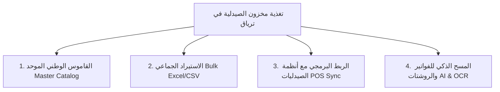

# 💊 خطة وإستراتيجية تغذية بيانات الأدوية الضخمة للصيدليات (Pharmacy Bulk Inventory & Big Data Strategy)

---

## 🛑 المشكلة الواقعية في السوق (The Market Challenge)

في سوق الصيدليات الفعلي (مصر والعالم العربي):
- تحتوي أي صيدلية متوسطة على ما بين **4,000 إلى 15,000 صنف دواء ومستلزمات طبية وتجميلية**.
- طلب إدخال الصيدلي لهذه الأدوية يدوياً دواءً دواءً هو **أمر مستحيل عملياً** ويؤدي إلى عزوف الصيدليات عن استخدام المنصة.
- حركة البيع والشراء في الصيدلية سريعة جداً وتتطلب تحديثاً مستمراً للمخزون والأسعار.

---

## 🎯 الحلول الأربعة المتكاملة في منصة ترياق (The 4-Pillar Solution)

---

## 1️⃣ الركيزة الأولى: القاموس الوطني الموحد للأدوية (Master Medicine Catalog)

### 💡 الفكرة:
بدلاً من أن يقوم كل صيدلي بإدخال اسم الدواء، المادة الفعالة، الجرعة، الشركة المصنعة، والصورة بنفسه:
1. تمتلك منصة **ترياق** قاعدة بيانات مركزية تضم أكثر من **15,000 دواء ومستحضر** مسجل بوزارة الصحة وهيئة الدواء (EDA).
2. في لوحة تحكم الصيدلي: بمجرد أن يكتب الصيدلي أول حرفين من اسم الدواء أو يمسح الباركود، يظهر له الدواء مباشرة بجميع بياناته المعتمدة وصورته.
3. يقتصر دور الصيدلي على خطوة واحدة فقط: **إدخال الكمية المتوفرة وتاريخ الصلاحية**، أو تغيير السعر في حال وجود خصم.

### 🚀 تم تفعيله برمجياً:
- تم دمج خاصية **Autocomplete السريعة** داخل نافذة إضافة الدواء في لوحة الصيدلي.
- تم توفير رابط سريع للبحث والمطابقة في الباك إند عبر `GET /api/medicines`.

---

## 2️⃣ الركيزة الثانية: الاستيراد والتصدير الجماعي (Bulk Excel & CSV Engine)

### 💡 الفكرة:
تمكين الصيدلية أو مدير النظام من رفع ملف إكسل أو شيت بآلاف الأدوية في ثانية واحدة.

### 🛠️ كيفية استخدام الصيدلية لهذه الميزة:
1. يدخل الصيدلي على صفحة **المخزون** في لوحة التحكم.
2. يضغط على زر **"استيراد شيت إكسل / CSV"**.
3. يمكنه تحميل **"قالب فارغ"** بضغطة زر وتعبئته، أو رفع تقرير المخزون المُصدَّر من برنامجه الحالي.
4. يقرأ النظام الأعمدة: `اسم الدواء`, `الكمية`, `السعر`, `تاريخ الصلاحية`.
5. يقوم الخادم (`POST /api/inventory/bulk-import`) بمطابقة الأدوية وتحديث المخزون دفعة واحدة في أجزاء من الثانية مع إعطاء تقرير بالكميات المضافة والمحدثة.

---

## 3️⃣ الركيزة الثالثة: الربط التلقائي مع برامج إدارة الصيدليات (POS & ERP Sync Agent)

### 💡 واقع السوق:
تعتمد 95% من الصيدليات على برامج إدارة صيدليات محلية شهيرة مثل:
- برنامج الروشتة (Roshetta)
- برنامج إيزي فارما (EasyPharma)
- برنامج فارما سوفت / البيان / فارما فلاي (PharmaFly)
- برامج مخصصة مبنية على SQL Server / Access / Oracle.

### 🏗️ الحل الهندسي (Teryak POS Connector):
1. **API Webhooks مفتوحة وآمنة:**
   - توفير Endpoint خاص بالصيدلية: `POST /api/inventory/sync-webhook` محمي بـ `API_KEY` لكل صيدلية.
   - يرسل برنامج الصيدلية تلقائياً أي فاتورة بيع أو استلام أدوية لتحديث المخزون على منصة ترياق فورياً.
2. **برنامج مزامنة صغير (Background Desktop Sync Agent):**
   - سكريبت أو برنامج خفيف يعمل في خلفية جهاز الصيدلية (Windows Service / Python Executable).
   - يقوم بالاستعلام عن قاعدة بيانات الصيدلية المحلية (Local DB) كل 15 أو 30 دقيقة ويرسل التعديلات في المخزون لمنصة ترياق عبر الـ API المشفر.

---

## 4️⃣ الركيزة الرابعة: المسح الضوئي الذكي لفواتير الموزعين (AI & OCR Invoice Ingestion)

### 💡 الفكرة:
تستلم الصيدليات بضائعها اليومية من شركات التوزيع الكبرى (مثل: **المتحدة، ابن سينا فارما، فارما أوفرسيز، المصرية**):
1. تلتقط الصيدلية صورة لفاتورة الشراء الورقية أو ترفع ملف الـ PDF الخاص بالفاتورة.
2. يستخدم نظام ترياق تقنية **OCR (مثل Google Cloud Vision API أو Tesseract)** لاستخراج أسماء الأدوية، الكميات، وتواريخ الصلاحية.
3. تظهر البيانات للصيدلي في جدول لمراجعتها بضغطة واحدة قبل اعتمادها وإضافتها للمخزون فوراً.

---

## 📅 خطة التنفيذ الميدانية الموصى بها لإطلاق المنصة (Go-To-Market Rollout Plan)

| المرحلة | الخطوة | التفاصيل الفنية والعملية |
|:---|:---|:---|
| **المرحلة 1: التدشين (Launch)** | تغذية الكتالوج الوطني المبدئي | تشغيل `npm run seed` لتعبئة قاعدة البيانات بكتالوج الأدوية الشائعة والبدائل. |
| **المرحلة 2: الصيدليات الأولى (Onboarding)** | الاستيراد عبر Excel/CSV | تدريب أول 20 صيدلية على تصدير ملفات أكسل من برامجهم ورفعها على ترياق بضغطة زر. |
| **المرحلة 3: التوسع والتكامل (Integration)** | إطلاق وكيل المزامنة POS Sync | إتاحة الـ Webhook وربط برامج الصيدليات الأكثر شيوعاً للمزامنة اللحظية. |
| **المرحلة 4: الأتمتة الكاملة (AI Era)** | مسح الفواتير بالـ OCR والباركود | إتاحة مسح فواتير شركات التوزيع عبر كاميرا الموبايل وتحديث المخزون مباشرة. |
